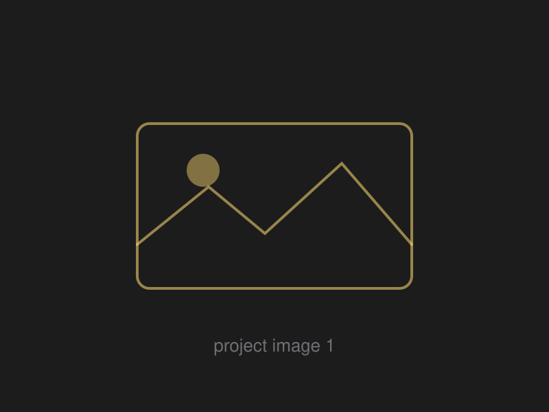

# Personal website template

A single-page portfolio site — hero, about, expertise cards, testimonials, resume
timeline, filterable project grid, and a contact form. Plain HTML, CSS, and
JavaScript: no build step, no dependencies, no framework. Edit the files, push,
done.

Structure modelled on a classic MBA/product-portfolio layout; all styling and
copy are original and yours to change.

```
index.html          all the content — this is the file you edit most
css/styles.css      theme variables at the top, then layout
js/main.js          nav, scroll reveal, portfolio filters, contact form
assets/img/         portrait, avatars, project thumbnails (SVG placeholders)
assets/files/       drop resume.pdf here
```

---

## Editing it

Everything you need to change in `index.html` is marked with an `EDIT` comment.
Work top to bottom:

| What | Where |
|---|---|
| Page title, description, social preview | `<head>` |
| Initials + name in the header | `.brand` |
| Name, role, blurb, location, email | Hero section |
| Social links (3 places: hero, contact, footer) | search for `YOUR-HANDLE` |
| Bio paragraphs and the three stat boxes | About section |
| "What I do" cards | `.cards` — duplicate a `<article class="card">` to add one |
| Testimonials | `.quotes` — duplicate a `<figure>`, or delete the whole block |
| Tool pills | `.tools` — plain text, add/remove `<li>` items |
| Jobs, education, leadership | Resume section — duplicate a `<li>` in `.timeline` |
| Projects | Portfolio section — see below |
| Contact copy and details | Contact section |

Search-and-replace these placeholders across the whole file when you start:

- `you@example.com` → your email
- `YOUR-HANDLE` → your LinkedIn handle
- `Saket Abdeo` → your name (if different)

### Adding a project

Copy one `<article class="project">` block and change four things:

```html
<article class="project reveal" data-category="Product Strategy">
  <a href="https://link-to-your-deck" target="_blank" rel="noopener">
    <div class="project-media">
      
    </div>
    <div class="project-body">
      <span class="tag">Product Strategy</span>
      <h3>Project name</h3>
      <p>One line on the problem, what you did, and the result.</p>
      <span class="project-link">View case study →</span>
    </div>
  </a>
</article>
```

`data-category` drives the filter buttons — they're generated from whatever
categories exist on the cards, so a new category adds its own button
automatically. Keep the `<span class="tag">` text matching `data-category`.

### Swapping images

The files in `assets/img/` are SVG placeholders. Drop your real images in the
same folder and update the `src` (change the `.svg` extension to `.jpg`/`.png`):

- `portrait` — square, ~800×800
- `avatar-1`, `avatar-2` — square, ~200×200
- `project-1` … `project-6` — 3:2 ratio, ~1200×800

Put your resume PDF at `assets/files/resume.pdf` and both download buttons work.

### Restyling

The top of `css/styles.css` is a block of CSS variables — colors, fonts,
spacing, corner radius. Change `--accent` alone and the whole site shifts.
Dark mode follows the visitor's system setting; delete the
`@media (prefers-color-scheme: dark)` block if you'd rather stay light-only.

Fonts are Fraunces (headings) and Inter (body), loaded from Google Fonts in
`index.html` — swap the `<link>` and the two `--font-*` variables to change them.

---

## Making the contact form actually send

GitHub Pages serves static files only, so it can't process a form on its own.
Two options:

1. **Formspree (free tier).** Sign up at <https://formspree.io>, create a form,
   and paste the endpoint into the `action=""` on `<form id="contactForm">`.
2. **Do nothing.** Until that endpoint is set, submitting the form opens the
   visitor's email client pre-filled with their message. Set `FALLBACK_EMAIL`
   near the bottom of `js/main.js` to your address so this works.

---

## Previewing locally

Open `index.html` in a browser, or run a local server for cleaner behaviour:

```bash
python3 -m http.server 8000
# then visit http://localhost:8000
```

---

## Publishing on GitHub Pages

In the repo: **Settings → Pages → Source: Deploy from a branch → `main` / `root`**,
then Save. It goes live in a minute or two.

Because this repo is named `saketabdeo.github.io` but lives under the
`abdeosaket23` account, GitHub treats it as a *project* site, so the URL is:

```
https://abdeosaket23.github.io/saketabdeo.github.io/
```

To get the clean `https://abdeosaket23.github.io/` instead, rename the repo to
**`abdeosaket23.github.io`** (Settings → General → Repository name) — it has to
match the username exactly.

Using your own domain? Add a file called `CNAME` at the repo root containing
just the domain (e.g. `saketabdeo.com`), then point a CNAME DNS record at
`abdeosaket23.github.io`.

`.nojekyll` is already included so GitHub serves the files as-is.

---

## License

MIT — do whatever you like with it.
