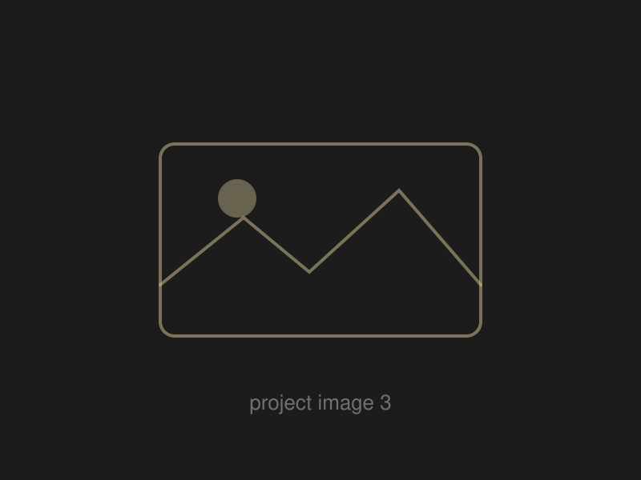

# Personal portfolio site

A dark, single-page portfolio: sticky profile sidebar on the left, and a panel on
the right that switches between **About**, **Resume**, **Portfolio**, and
**Contact** without reloading. Plain HTML, CSS, and JavaScript — no build step,
no framework, no dependencies beyond Google Fonts.

Layout and design language follow the open-source
[vCard](https://github.com/codewithsadee/vcard-personal-portfolio) template
(MIT), rewritten here from scratch with inline SVG icons instead of an icon CDN.

```
index.html          all the content — this is the file you edit
css/styles.css      theme tokens at the top, then layout
js/main.js          tabs, sidebar toggle, filters, contact form
assets/img/         avatar, career-chart marks, project thumbs, tool logos
assets/files/       drop resume.pdf here
404.html            styled not-found page
```

---

## Editing it

Every spot you need to change in `index.html` is marked with an `EDIT` comment.

| What | Where |
|---|---|
| Page title, description, social preview | `<head>` |
| Ticker tape entries | `.ticker-list` — see below |
| Name and job title | `.sidebar-info` |
| Email, education, location rows | `.contacts-list` |
| Social links | `.social-list` and the sidebar |
| Bio paragraphs | `.about-text` |
| Key metric tiles | `.metrics-list` — see below |
| "My Expertise" cards | `.service-list` — duplicate a `<li class="service-item">` |
| Platforms & tools | `.tools-grid` — duplicate a `<li class="tool-card">`; the glyph is inline SVG on a 24x24 grid |
| Education / experience entries | `.timeline-list` — duplicate a `<li class="timeline-item">` |
| Competency radar | `.radar-legend` — see below |
| Certifications | `.certs-list` — duplicate a `<li class="cert-card">` |
| Skill bars | `.skills-list` — set `data-level="0–100"` |
| Projects | `.project-list` — see below |
| Contact form | `.contact-form` |
| Command palette entries | the `COMMANDS` array in `js/main.js` |

Start with a find-and-replace across the whole file:

- `you@example.com` → your email
- `YOUR-HANDLE` → your LinkedIn handle
- `Saket Abdeo` → your name
- the bracketed blanks like `[Your Program]`, `[N]`, `[outcome]`

### The 3D avatar

The avatar in the sidebar is a real CSS-3D scene, not a tilted image. Five
layers sit at different `translateZ` depths — glow, disc, ring, face, gloss —
so they separate as it turns toward your cursor. Three credential chips orbit
it on a ring, counter-spinning so their labels always face you.

Drag it and it pops out of the sidebar and follows the pointer; let go with
some speed and it flies, bouncing off the edges of the window with a squash on
impact. Double-click it (or run "Send avatar home" from `⌘K`) to send it back.
The slot it leaves behind holds the layout, so nothing shifts.

**Using your own Bitmoji or Memoji.** Save it as a square image — a transparent
PNG is best, since the disc behind it becomes the backdrop — into
`assets/img/`, then point the `.av-face` `src` at it:

```html

```

- **Bitmoji:** bitmoji.com → sign in → pick a pose → right-click → save image.
  Or export from the Bitmoji app.
- **Memoji:** open Messages, tap the Memoji sticker, send it to yourself, then
  save the image.

Aim for roughly 400×400. If your image has a solid background, either remove it
or set `.av-disc { background: none }` so the two don't fight.

Edit the chips in the same block — keep them to three or four short labels:

```html
<span class="av-chip" style="--a: 0deg"><i>MBA</i></span>
```

`--a` is where each chip sits on the ring. The chips are hidden below 1250px,
where the avatar sits inline beside your name and there's no room to orbit.

### The career chart

The chart on the About panel is the signature piece: your career rendered as a
candlestick chart. You don't author OHLC data — each year is one line, and the
candles are derived (each year opens at the previous year's close and closes at
its own value, with a proportional wick):

```html
<li data-year="Sep '23" data-value="72" data-label="Trade Finance Officer"
    data-months="24"
    data-range="Sep 2023 – Aug 2025"
    data-logo="assets/img/logos/jsw.svg"
    data-awards="JSW: Best Newcomer of the Quarter (2023–2024)|JSW: Change Catalyst (2023–2024)"
    data-note="JSW, Mumbai — FX settlements across 4+ currencies, volumes to $3M."></li>
```

`data-kind="study"` hangs a graduation cap off the corner of that step's mark,
so a degree or a certification reads apart from a job at a glance — the chart
mixes the two freely and the cap is what tells them apart.

A block is as tall as the step was long: `data-months` sets the height, so a
two-month internship draws short and a two-year role draws tall. The block is
centred on its own close, which is where the trend line runs, and the axis
reserves room for half of the tallest block at either end. Leave `data-months`
off and that step falls back to the size of its own move.

One `<li>` is one step, not necessarily one year: a degree, a role, a
certification. `data-year` is the short tick under it and `data-range` the full
dates in the tooltip. `data-awards` holds anything won at that step, separated
by `|` — each award draws a star over the candle and a line in the tooltip.

`data-value` is an arbitrary "career index" — it only matters relative to the
other steps, and the axis rescales to whatever range you use. `data-label` and
`data-note` show in the tooltip on hover (or on drag, on touch). The headline
quote above the chart is computed from the first and last values.

`data-logo` is optional: point it at a square image and the chart draws it on
a small plate above that year's candle, riding the trend line. The marks in
`assets/img/logos/` are monograms — plain SVG text, gold for a school and grey
for an employer. To use a real logo, drop the file into that folder and change
the one attribute; nothing else needs touching. Square marks work best, since a
wide wordmark shrinks to nothing inside a 26px plate. The top padding of the
plot opens up on its own when any year carries a logo.

Add or remove `<li>` entries freely; the chart re-lays itself out, and year
labels thin to every other one past seven entries.

### The ticker tape

Each `<li class="ticker-item">` is one entry. `data-dir` picks the arrow and
colour — `up` (green ▲), `down` (red ▼), `flat` (grey dash):

```html
<li class="ticker-item" data-dir="up">
  <span class="tkr-sym">IRR</span>
  <span class="tkr-val">21.6% base case</span>
  <span class="tkr-chg">+430bps</span>
</li>
```

The strip is cloned in JS so the loop is seamless — edit the one list only.
Hovering pauses it. Aim for 6–10 entries; fewer than that and the gap shows.

### Key metric tiles

```html
<li class="metric-card content-card">
  <p class="metric-label">AUM Analysed</p>
  <p class="metric-value" data-count-to="240" data-prefix="$" data-suffix="M">$0M</p>
  <svg class="sparkline" data-spark="4,7,5,9,8,12,11,16,15,19" viewBox="0 0 100 30" preserveAspectRatio="none"></svg>
  <p class="metric-note"><span class="delta" data-dir="up">+12%</span> YoY</p>
</li>
```

`data-count-to` is the number it counts up to when the tile scrolls into view;
add `data-decimals="1"` for one decimal place. `data-spark` is any list of
numbers — the sparkline is drawn and scaled from them, so the values only need
to be right relative to each other.

### Competency radar

The chart is drawn from the hidden list beneath it. Three to eight axes read
best, and short labels avoid crowding the edges:

```html
<ul class="radar-legend" data-radar-data>
  <li data-label="Valuation" data-value="92"></li>
  <li data-label="Modelling" data-value="88"></li>
</ul>
```

### Adding a project

Copy one `<li class="project-item">` and change four things:

```html
<li class="project-item active" data-filter-item data-category="web design">
  <a href="https://link-to-your-case-study" target="_blank" rel="noopener">
    <figure class="project-img">
      <div class="project-item-icon-box"> …eye icon, leave as-is… </div>
      
    </figure>
    <h3 class="project-title">Project name</h3>
    <p class="project-category">Web Design</p>
  </a>
</li>
```

`data-category` drives the filters. The filter row (desktop) and the dropdown
(mobile) are both generated from whatever categories exist on the cards, so a new
category creates its own filter button automatically — nothing else to update.
Keep `class="active"` on new items so they show under "all", and keep the
`.project-category` text matching `data-category`.

### Swapping images

Files in `assets/img/` are SVG placeholders. Drop your real images in the same
folder and update the `src` (change the `.svg` extension to `.jpg`/`.png`):

- `my-avatar` — sidebar photo, square, ~400×400
- `project-1` … `project-6` — 4:3 ratio, ~800×600

Put your resume PDF at `assets/files/resume.pdf` and the download button works.

### Restyling

The top of `css/styles.css` is a block of custom properties — colours, gradients,
shadows, font sizes. The accent is `--orange-yellow-crayola` plus the two
`--bg-gradient-yellow-*` and `--text-gradient-yellow` values; change those four
and the whole site moves to a different colour. `--gain` and `--loss` are the
green/red used by the ticker and the metric deltas. Type is Poppins for text and
JetBrains Mono for numbers, both from Google Fonts in `index.html`.

The three background layers each live in their own CSS block under
`BACKGROUND LAYERS` — the graph-paper `.bg-grid`, the drifting `.bg-aurora`
blobs, and the `.bg-noise` grain. Delete a block and its `<div>` in `index.html`
to drop that layer.

---

## Motion and interaction

| Feature | How it works |
|---|---|
| Career chart | Candles grow in sequence, the trend line draws itself, the latest point pulses; crosshair + tooltip on hover, drag to scrub on touch |
| Market clock | Live New York time with NYSE open/closed state (regular hours, holidays not handled) |
| Panel transitions | Moving to a later tab slides in from the right, an earlier tab from the left |
| Swipe | Swipe left/right anywhere on the content to change panel (touch devices) |
| Keyboard | `1`–`4` jump to a panel, `←`/`→` step through, `Esc` closes overlays |
| Command palette | `⌘K` / `Ctrl+K`, or the button bottom-right on desktop |
| Scroll reveal | Sections fade up in sequence as they enter view |
| Counters and charts | Metric numbers count up, sparklines draw, the radar scales in, skill bars fill — all on first scroll into view |
| Card tilt | Cards tilt toward the cursor with a spotlight glow (desktop pointers only) |
| Scroll progress | Thin gradient bar across the top of the window |
| Copy email | The button beside the email address, or the palette entry; confirms with a toast |
| Print | `⌘P` (or the palette's "Print resume") prints just the Resume panel, black on white |

Everything decorative is disabled automatically for visitors who have
"reduce motion" turned on in their OS.

---

## Making the contact form actually send

GitHub Pages serves static files only, so it can't process a form. Two options:

1. **Formspree (free tier).** Sign up at <https://formspree.io>, create a form,
   and paste the endpoint into `action=""` on `<form data-form>`.
2. **Do nothing.** Until that endpoint is set, submitting opens the visitor's
   email client pre-filled. Set `FALLBACK_EMAIL` in `js/main.js` to your address.

---

## Previewing locally

```bash
python3 -m http.server 8000
# then open http://localhost:8000
```

---

## Publishing on GitHub Pages

Settings → Pages → Source: **Deploy from a branch** → `main` / `/ (root)` → Save.

A repo only becomes a *user site* (served at `username.github.io`) when its name
matches the username exactly. Rename the repo to **`abdeosaket23.github.io`** for
the clean URL; any other name serves at
`abdeosaket23.github.io/<repo-name>/`, which works identically — every path in
this template is relative.

Custom domain? Add a `CNAME` file at the repo root containing just the domain,
then point a CNAME DNS record at `abdeosaket23.github.io`.

`.nojekyll` is included so GitHub serves the files as-is.

---

## License

MIT.
